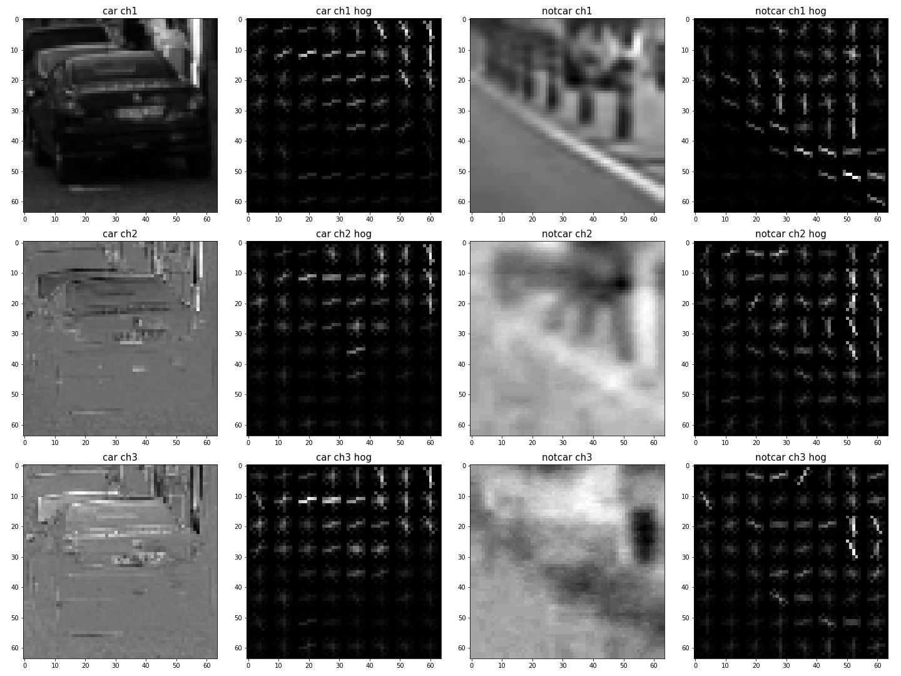
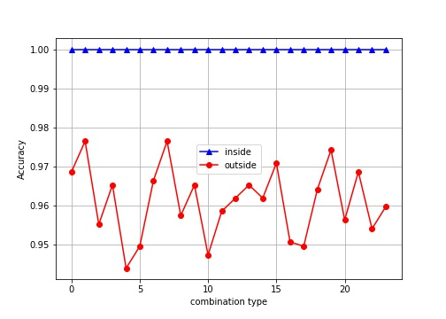
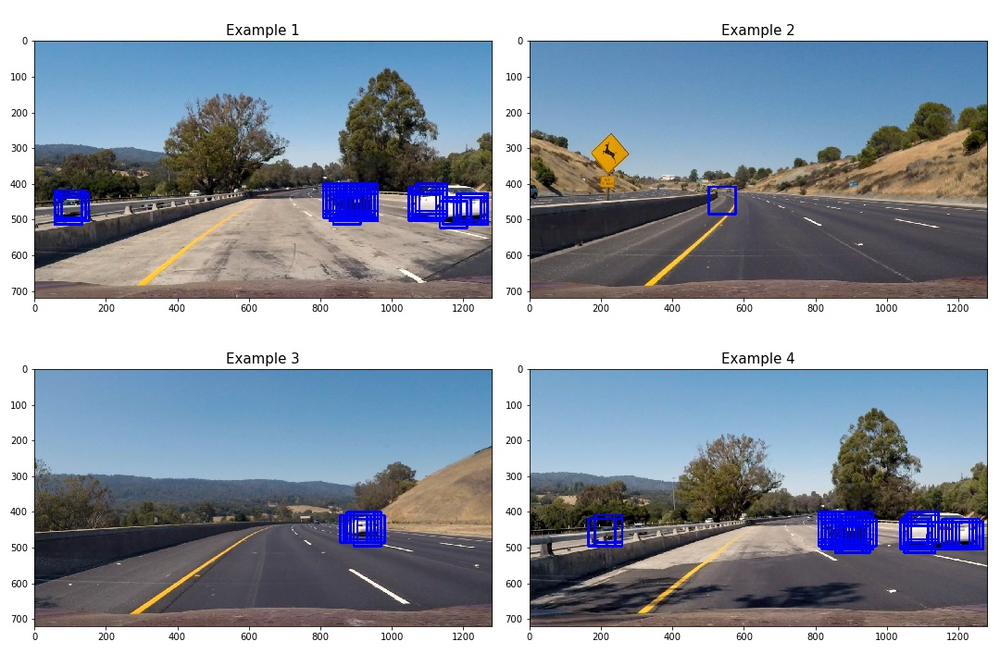
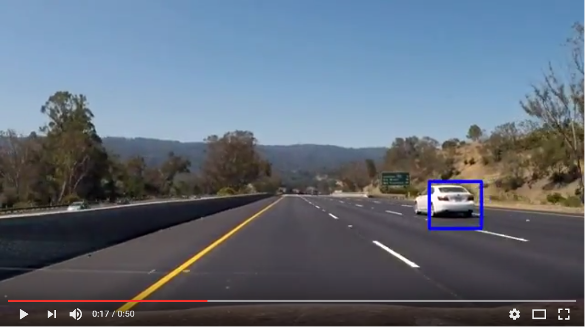

## Vehicle Detection Project
**Vehicle Detection Project**

The goals / steps of this project are the following:

1. Perform a Histogram of Oriented Gradients (HOG) feature extraction
    I implement HOG feature extraction and using a subset of training data to search a good settings of parameters. Images are stored in `output_images/HOG_with_YCrCb.jpg` and `output_images/grid_search.jpg`
2. Train Classifier
    I trained a Linear SVM classifier with HOG + color_hist + bin_spatial which achieved 98% accuracy on test set.
3. Sliding Window Search
    I implemented a sliding window search method with two scales of window. HOG features are extracted once for an given image.
4. Showing Examples so far
    I showed 4 examples with the pipeline so far. Image is stored in `output_images/example_before_post_processing.jpg`
5. Video Implementation
    I showed the results with a short video clip (test_video.mp4) as well as the [final result](https://youtu.be/f4AJoeI5_3c) that adopted post-processing below.
6. Further Post-processing
    A buffer for heat-maps is used for keeping a 6 consecutive heat-maps in frames. This will filtered out some false accepts.
7. Discussion
    A short discussion is made.

--
## [Rubric](https://review.udacity.com/#!/rubrics/513/view) Points

---
### 1. Histogram of Oriented Gradients (HOG)

> Explain how (and identify where in your code) you extracted HOG features from the training images. Explain how you settled on your final choice of HOG parameters.

I randomly selected examples of `car` and `notcar` and showed their HOG results in each channel of HLS space:

<div align=center></div>

In order to get a good enough setting for those parameters (`orientations`, `pixels_per_cell` and `cells_per_block`), I applied a **grid searching method** with a linear SVM on a **small subset** of training data. Grid searching space is defined as follows (24 combinations):

```python
orient_set = range(9,19,3)
pix_per_cell_set = [4,8,16]
cell_per_block_set = [1,2]
```

<div align=center></div>

The purpose of this stage is not finding the optimal, but rather, a good enough setting. So I choose **`orient=15, pix_per_cell=8, cell_per_block=2, cspace='RGB2YCrCb'`**

---
### 2. Train Classifier

> Describe how (and identify where in your code) you trained a classifier using your selected HOG features (and color features if you used them).

Before training the classifier, dataset should be processed first.
Since the `vehicles/GTI*/*.png`  contains **time-series data**, I **manually selected** images to avoid train and test sets having identical images. In addition, **20%** images in each training folder are treated as test images. The same partition method applied to non-vehicles images too.

Then I trianed a Linear SVM model with HOG + color_hist + bin_spatial features which has performance:

```python
inside-acc=1.0, outside-acc=0.9802036199095022
```

---
### 3. Sliding Window Search

> Describe how (and identify where in your code) you implemented a sliding window search. How did you decide what scales to search and how much to overlap windows?

The course provided a very useful code snippet that can extract HOG features once no matter how much windows are. So I reuse it as the feature extraction function!
I used two types of scales, 1.5 and 1.2, which deal with large and small window respectively (car with near and far positions from camera). Also, I found that the overlaping of cells_per_step = 1 (more dense windows) has better results in my implementation.

Before going through, it is worth checking the image values. Since feature extraction pipeline processed `.png` files with `mpimg.imread`, it reads images with values [0,1].

However, mpimg.imread reads the .jpg file with values within [0,255]. So it is necessary to divide 255 before calling the feature extraction pipeline while reading .jpg images with mpimg.imread.

> **Make sure your images are scaled correctly**

>The training dataset provided for this project ( vehicle and non-vehicle images) are in the .png format. Somewhat confusingly, matplotlib image will read these in on a scale of 0 to 1, but cv2.imread() will scale them from 0 to 255. Be sure if you are switching between cv2.imread() and matplotlib image for reading images that you scale them appropriately! Otherwise your feature vectors can get screwed up.

>To add to the confusion, matplotlib image will read .jpg images in on a scale of 0 to 255 so if you are testing your pipeline on .jpg images remember to scale them accordingly. And if you take an image that is scaled from 0 to 1 and change color spaces using cv2.cvtColor() you'll get back an image scaled from 0 to 255. So just be sure to be consistent between your training data features and inference features!

---
### 4. Showing Examples

> Show some examples of test images to demonstrate how your pipeline is working. How did you optimize the performance of your classifier?

The followings are some examples. As you can see in the example 2, there exists a **false accept**. This will be filtered out in the **post-processing** part.

<div align=center></div>

---
### 5. Video Implementation

> Provide a link to your final video output. Your pipeline should perform reasonably well on the entire project video (somewhat wobbly or unstable bounding boxes are ok as long as you are identifying the vehicles most of the time with minimal false positives.)

Following is the final result (combined with post-processing as described below)
[](https://youtu.be/f4AJoeI5_3c)

---
### 6. Further Post-processing

> Describe how (and identify where in your code) you implemented some kind of filter for false positives and some method for combining overlapping bounding boxes.

A heat-map to further filtered out some false positives. Moreover, I used a buffer to keep the 6 consecutive frames of heat-maps, and then accumulated those heat-maps in buffer. The accumulated heat-map then thresholded and produced the final results.

---
### 7. Discussion

> Briefly discuss any problems / issues you faced in your implementation of this project. Where will your pipeline likely fail? What could you do to make it more robust?

There still have too much parameters that effect the robustness, like `ystart`, `ystop`, `scale factors`, `thresholds` for heat-maps, and etc. Moreover, with more challanging conditions, those settings might work in one condition but fail in others.

I think the most important part in those pipelines is the classifier itself. The linear SVM I used in this project is not good enough as you can see in the video that still has few false accepts. So a deep-learning based classifier might achieve better results and actually helpful to the following pipelines. This would be my future work.
